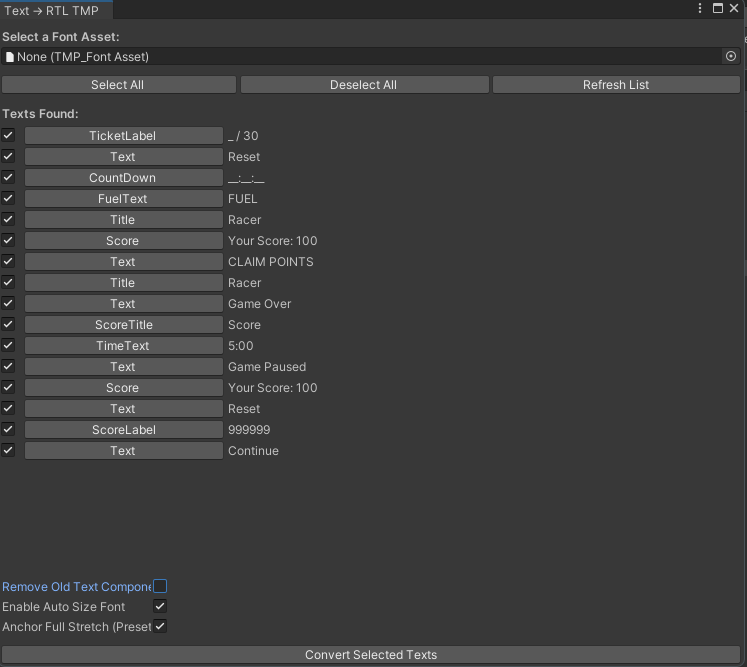

# Text to RTLTextMeshPro Converter (یونیتی)

🧩 Converts UnityEngine.UI.Text to RTLTextMeshPro for better right-to-left language support in Unity UI.

📦 Requires:
- [TextMeshPro](https://docs.unity3d.com/Packages/com.unity.textmeshpro@latest)
- [RTLTMPro (RTL TextMeshPro)](https://github.com/kamranahmadi/rtltextmeshpro)

---

## 🔧 Features
- Automatically adds a child RTLTextMeshPro with correct settings
- Option to remove old `Text` components
- Adds `Rtl_` prefix to new GameObject name
- Applies full-stretch anchor preset
- Enables Auto Size
- Configurable via checkboxes in the editor

---

## 🖼️ Screenshot

---

## 🏁 How to Use
1. Open Unity
2. Go to **Tools → Convert UI.Text to RTLTextMeshPro**
3. Assign a TMP FontAsset
4. Select desired texts and click **Convert**

---

# تبدیل متن ساده یونیتی به RTLTextMeshPro

🎯 این ابزار برای تبدیل خودکار `Text`‌های معمولی یونیتی به `RTLTextMeshPro` طراحی شده.

📦 پیش‌نیاز:
- [TextMeshPro](https://docs.unity3d.com/Packages/com.unity.textmeshpro@latest)
- [RTLTMPro (پشتیبانی زبان‌های راست‌به‌چپ)](https://github.com/kamranahmadi/rtltextmeshpro)

---

## قابلیت‌ها
- ساخت خودکار فرزند `RTLTextMeshPro`
- امکان حذف کامپوننت قبلی Text
- اضافه‌کردن پیشوند `Rtl_` به نام گیم‌آبجکت جدید
- تنظیم Anchor به حالت Full Stretch
- فعال کردن Auto Size فونت
- فعال/غیرفعال‌سازی این امکانات با چک‌باکس

---

## 🖼️ نمایی از محیط ابزار

---

## 📥 نحوه استفاده
1. وارد یونیتی شوید
2. مسیر **Tools → Convert UI.Text to RTLTextMeshPro** را باز کنید
3. یک فونت TMP انتخاب کنید
4. موارد دلخواه را تیک زده و گزینه **Convert** را بزنید

---

## License

This project is licensed under the MIT License - see the [LICENSE](LICENSE) file for details.
